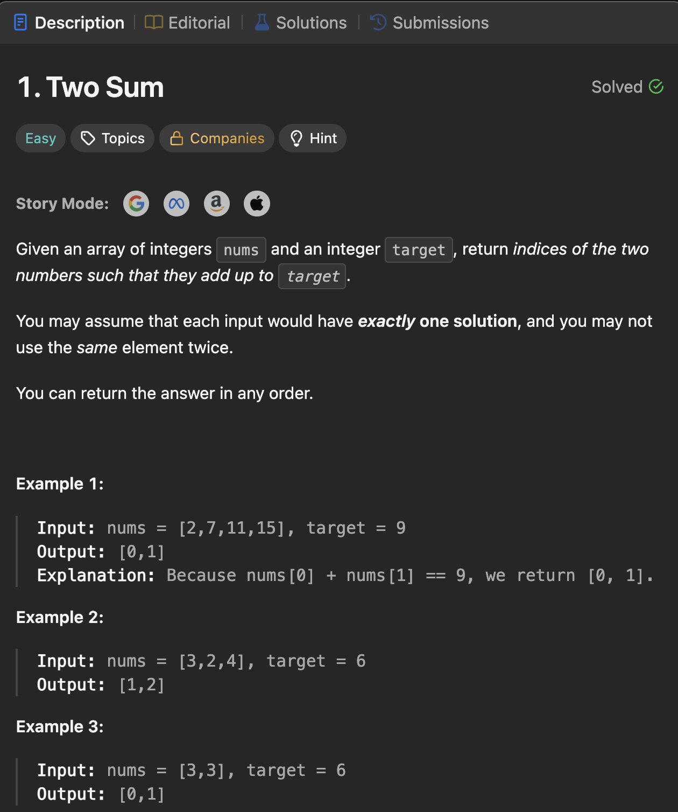
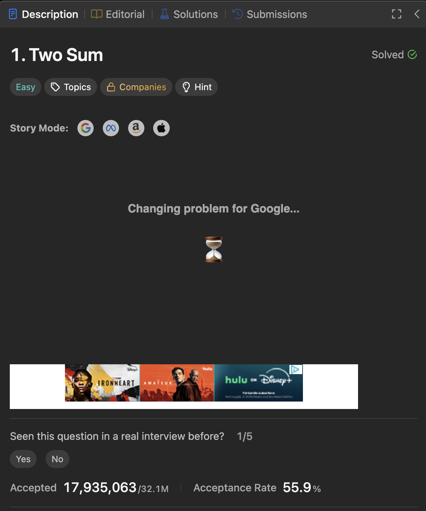
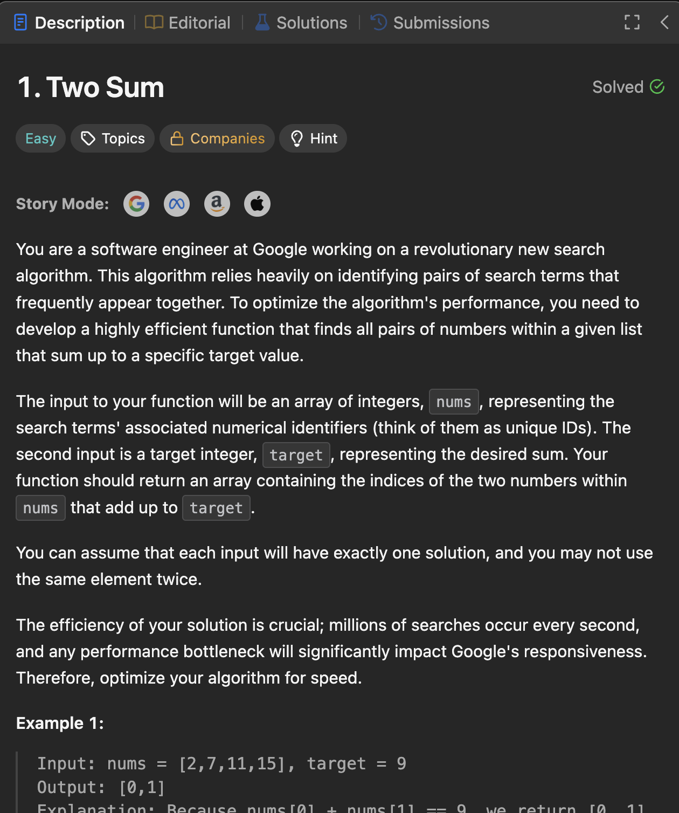
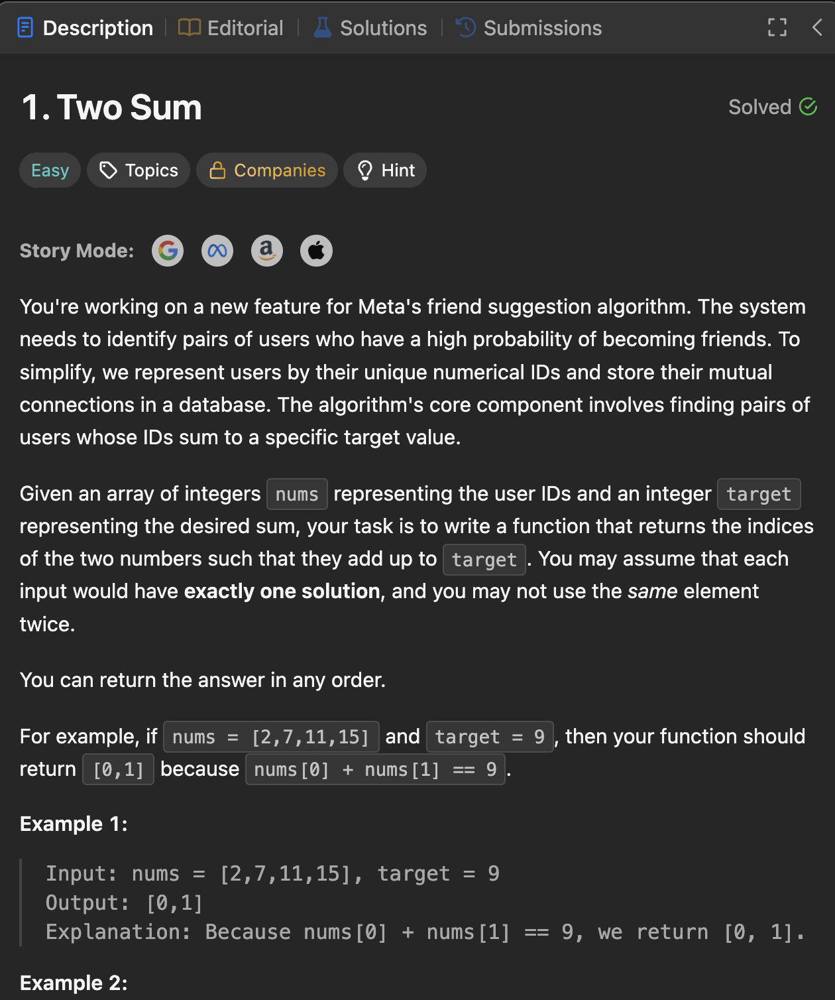

# LeetStory 

> Level up your LeetCode practice by transforming coding problems into engaging, real-world interview scenarios at top tech companies like Google, Meta, and Amazon (MAANG).

-----

## What is LeetStory?

**LeetStory** is a Chrome extension designed to make your LeetCode grind more immersive and effective. Instead of just reading a technical problem description, LeetStory rephrases the problem as if it were a question being asked in a job interview at your dream company. This helps you:

  * **Understand the "Why"**: See the practical application of algorithms and data structures in real-world contexts.
  * **Improve Communication**: Start thinking about how to explain your approach in a more conversational, interview-like setting.
  * **Stay Engaged**: Turn the often dry problem descriptions into interesting scenarios.

-----

## Screenshots

### Problem Description (Before)


### Story Mode Activated (After - Google)




### Story Mode Activated (After - Meta)

-----

## How to Use

### 1\. Clone the Repository

First, clone this repository to your local machine:

```bash
git clone https://github.com/jayanthanala/leetstory.git
```

### 2\. Install as a Chrome Extension

1.  Open Google Chrome.
2.  Navigate to `chrome://extensions/`.
3.  Enable **"Developer mode"** in the top right corner.
4.  Click **"Load unpacked"** in the top left corner.
5.  Select the `leetstory` folder where you cloned the repository.

### 3\. Start the Backend Server

1.  Make sure you have Node.js and npm installed.
2.  Open a terminal in the root of your `leetstory` folder.
3.  Install the dependencies:
    ```bash
    npm install
    ```
4.  Create a `.env` file in the root directory and add your Gemini API key. Get your key from the [Google AI Studio](https://ai.google.dev/).
    ```
    GEMINI_API_KEY=YOUR_API_KEY
    ```
5.  Start the backend server:
    ```bash
    npm start
    ```

### 4\. Start Practicing\!

1.  Navigate to any LeetCode problem page (e.g., [https://leetcode.com/problems/two-sum/](https://leetcode.com/problems/two-sum/)).
2.  You should see the company logos displayed neatly below the problem's tags.
3.  Click on a company logo to instantly rephrase the problem into a relevant interview scenario\!

-----

## Contributing

If you'd like to contribute to LeetStory, feel free to:

  * Suggest new features
  * Report bugs
  * Submit pull requests with improvements